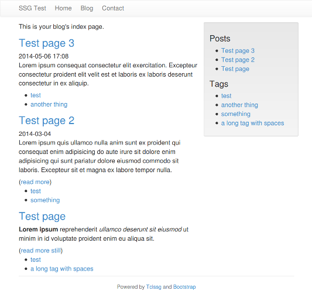

[](https://travis-ci.org/tclssg/tclssg)

Tclssg is a static site generator with template support written in Tcl for danyilbohdan.com. It is intended to make it easy to manage a small to medium-sized personal website with an optional blog, "small to medium-sized" meaning one with under about 2000 pages. Tclssg uses Markdown for content formatting, [Bootstrap](http://getbootstrap.com/) for layout (with Bootstrap theme support) and Tcl code embedded in HTML for templating.

**Warning! Tclssg is currently in beta and may still change in incompatible ways.**

Features
--------

* [Markdown](#markup), Bootstrap themes, Tcl code for [templates](https://github.com/tclssg/tclssg/wiki/Templating);
* Plain old pages and blog posts [1];
* RSS feeds;
* SEO and usability features out of the box: site maps, canonical and previous/next links, noindex on collection pages.
* Valid HTML5 and CSS level 3 output;
* Deployment over FTP;
* Deployment over SCP or other protocols with a [custom deployment command](https://github.com/tclssg/tclssg/wiki/Using-deployCustom);
* Support for external comment engines (currently: Disqus);
* Relative links in the HTML output by default that make it suitable for viewing over *file://*;
* [Reasonably fast](https://github.com/tclssg/tclssg/wiki/Performance);
* Few dependencies. Experimental self-contained [binaries](https://github.com/tclssg/tclssg/wiki/Binaries) are available for Linux, Windows and Mac.

1\. A blog post differs from a plain old page in that it has a sidebar with links to other blog posts sorted by recency and tags. The latest blog posts are featured on the blog index and tag pages are generated to collect blog posts with the same tag.

Page screenshot
---------------


Getting started
---------------

Tclssg is known to run on Linux, FreeBSD, OpenBSD, NetBSD, OS X and Windows XP/7/8.x.

To use it you will need Tcl 8.5 or newer, Tcllib and SQLite version 3 bindings for Tcl installed.

To install those on **Debian** or **Ubuntu** run the following command:

    sudo apt-get install tcl tcllib libsqlite3-tcl

On **Fedora**, **RHEL** or **CentOS**:

    su -
    yum install tcl tcllib sqlite-tcl

On **Windows** the easiest option is to install ActiveTcl from [ActiveState](http://activestate.com/). The copy of Tcl that comes with [Git for Windows](http://msysgit.github.io/) does not include Tcllib or an SQLite 3 module, so it will not run Tclssg out of the box. After installing ActiveTcl run

    c:\Tcl\bin\teacup.exe install html

On **OS X** use [MacPorts](https://www.macports.org/) or install ActiveTcl for Mac. With MacPorts:

    sudo port install tcllib tcl-sqlite3

Once you have the dependencies installed clone this repository, `cd` into it then run

    chmod +x ssg.tcl
    ./ssg.tcl init
    ./ssg.tcl build
    ./ssg.tcl open

or on Windows

    ssg.cmd init
    ssg.cmd build
    ssg.cmd open

This will create a new website project in the directory `website/input` based on the default project skeleton, build the website in `website/output` and open the result in your web browser.

Markup
------

Write [Markdown](http://daringfireball.net/projects/markdown/syntax) and use `<!-- more -->` to designate the break between the teaser (the part of the article shown on the blog index and on tag pages) and the rest of the content. Use page settings to customize the page's output. Example:

```markdown
{
    title {Test page}
    blogPost 1
    tags {test {a long tag with spaces}}
    date 2014-01-02
    hideDate 1
}
**Lorem ipsum** reprehenderit _ullamco deserunt sit eiusmod_ ut minim in id
voluptate proident enim eu aliqua sit.

<!-- more -->

Mollit ex cillum pariatur anim [exemplum](http://example.com) tempor
exercitation sed eu Excepteur dolore deserunt cupidatat aliquip irure in
fugiat eu laborum est.
```

User's guide
------------

For more information on how to use Tclssg read the **User's guide** on the [project wiki](https://github.com/tclssg/tclssg/wiki).

Answers to frequently asked questions can be found on the [FAQ page](https://github.com/tclssg/tclssg/wiki/FAQ).

License
-------

MIT. See the file `LICENSE` for details.

The Tclssg logo images are copyright (c) 2014 Danyil Bohdan and are licensed under [CC BY 4.0](https://creativecommons.org/licenses/by/4.0/).

The [stackato-cli](https://github.com/ActiveState/stackato-cli) browse package is copyright (c) 2011-2012 ActiveState Software Inc. and is distributed under the Apache License, Version 2.0. See `external/browse/license.txt`.

The [Caius](https://github.com/tobijk/caius) Markdown package 1.0 is copyright (c) 2014 Caius Project and is distributed under the MIT license. See `external/markdown/markdown.tcl`.

Bootstrap 3.3.1 is copyright (c) 2011-2014 Twitter, Inc and is distributed under the MIT license. See `skeleton/static/external/bootstrap-3.3.1-dist/LICENSE`.
